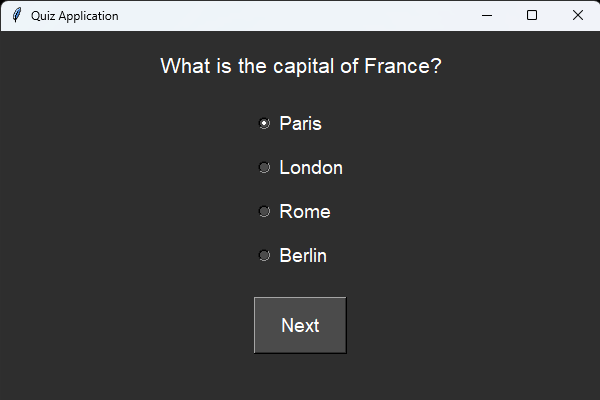

# Quiz Application

This is a simple quiz application built using Python's `tkinter` library. The application presents a series of multiple-choice questions to the user and displays the score at the end.

## Features

- Over 50 questions on various topics.
- Randomized questions if the user opts to answer only half of the questions.
- User-friendly GUI with a dark theme.
- Real-time score tracking.

## Requirements

- Python 3.x
- `tkinter` (usually included with Python installations)

## Usage

1. Clone this repository or download the source code.
2. Run the `quiz_app.ipynb` file using Python:

```bash
python quiz_app.ipynb
```

3. Follow the on-screen instructions to answer the quiz questions.

## Screenshot



## Author

This quiz application was created by Muhammad Yousaf. For any inquiries, please contact [yousafsahiwal3@gmail.com](mailto:yousafsahiwal3@gmail.com).
```


